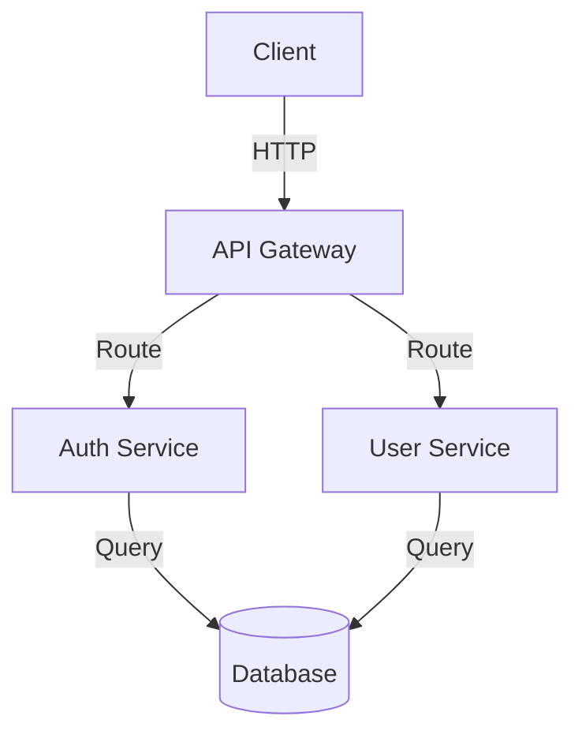

# Design Phase Implementation Summary

## Status: ✅ COMPLETE

Design phase behavior has been successfully implemented with structured design thinking enforcement and code prevention.

---

## What Was Implemented

### 1. RequireMultipleDesignOptionsRule Validation Rule

**File:** `lathe/validation/rules.py`

**Purpose:** Enforce that design phase presents at least 2 different design options.

**Detection Logic:**
- Counts explicit option markers: "Option 1", "Option 2", "Approach 1", "Approach 2", etc.
- Detects implicit options through keywords: "option" + "another", "alternative" + "however/versus"
- Requires minimum 2 options to pass

**Configuration:**
- Severity: WARN (warns but allows proceeding)
- Minimum options: 2 (configurable)

**Detection Examples:**
✅ "Option 1: PostgreSQL" + "Option 2: MongoDB" → PASS
✅ "The first approach uses..." + "An alternative approach uses..." → PASS
❌ "Use PostgreSQL" (no alternatives) → WARN

---

### 2. RequireTradeoffsRule Validation Rule

**File:** `lathe/validation/rules.py`

**Purpose:** Enforce that design discusses tradeoffs and implications.

**Detection Logic:**
- Scans for tradeoff-related keywords across 18+ markers
- Keywords include: "tradeoff", "pros and cons", "strengths/weaknesses", "complexity", "performance", "scalability", "maintainability", "cost", "risk", "versus", "however", etc.
- Requires minimum 3 different tradeoff indicators

**Configuration:**
- Severity: WARN
- Tradeoff markers: 18+ keywords

**Detection Examples:**
✅ Discusses "performance impact" + "scalability" + "complexity" → PASS
✅ "However, this approach has trade-offs: cost vs performance" → PASS
❌ No tradeoff discussion → WARN

---

### 3. AllowDiagramsRule Validation Rule

**File:** `lathe/validation/rules.py`

**Purpose:** Verify presence of architectural descriptions/diagrams.

**Detection Logic:**
- Looks for diagram indicators: ASCII art markers (┌─, ├─, └─, │), Mermaid syntax (graph, flowchart, ~~~mermaid)
- Also detects architecture keywords: "architecture", "diagram", "sequence", "component", "deployment"
- Requires minimum 1 diagram indicator

**Configuration:**
- Severity: WARN
- Diagram indicators: 14+ patterns

**Detection Examples:**
✅ ASCII box drawing + "Architecture:" → PASS
✅ Mermaid diagram block → PASS
✅ Text "The architecture shows components connected via..." → PASS
❌ No diagram or architecture description → WARN

---

### 4. System Prompt Enforcement

**Files:** `lathe_tool.py` and `lathe/tool/wrapper.py`

**Added:** Design-specific enforcement text

**Prompt Text:**
```
DESIGN PHASE REQUIREMENTS:
- NO CODE OUTPUT - You must not write executable code or implementations
- MUST present multiple design options - Consider at least 2 different approaches
- MUST discuss tradeoffs - Explain pros, cons, and implications of each option
- CAN use diagrams - ASCII art and Mermaid diagrams are encouraged
- MUST include architecture descriptions - How components interact

ALLOWED IN DESIGN:
- Architecture descriptions and diagrams
- Tradeoff tables and comparisons
- Design patterns and their justification
- Migration or transition strategies
- Interface specifications (without implementation)
- Component relationships and data flow

FORBIDDEN IN DESIGN:
- Executable code or code fragments
- SQL queries or database schemas
- Configuration files
- Shell commands or deployment scripts

REQUIRED STRUCTURE:
1. Design Options (at least 2)
2. Tradeoff Analysis for each option
3. Architecture Description or Diagram
4. Recommended Approach with justification
```

---

### 5. Default Rules Configuration

**Files:** `lathe_tool.py` and `lathe/tool/wrapper.py`

**Updated:** Design phase default rules

**Configuration:**
```python
"design": [
    "no_code_output",                      # FAIL if code detected
    "require_multiple_design_options",     # WARN if <2 options
    "require_tradeoffs",                   # WARN if no tradeoffs
    "allow_diagrams"                       # WARN if no diagram/architecture
]
```

**Severity Mapping:**
- `no_code_output`: FAIL (critical - prevents code)
- `require_multiple_design_options`: WARN (guides quality)
- `require_tradeoffs`: WARN (guides quality)
- `allow_diagrams`: WARN (guides quality)

---

### 6. Documentation

**File:** `DESIGN_PHASE.md`

**Contents:**
- Phase purpose and boundaries
- Validation rules and examples
- Good vs bad design output
- ASCII and Mermaid diagram examples
- Tradeoff analysis examples
- Testing instructions
- Integration guide with OpenWebUI
- Phase differences (Analysis vs Design)

---

## Files Changed

1. **`lathe/validation/rules.py`**
   - Added `RequireMultipleDesignOptionsRule` class (60 lines)
   - Added `RequireTradeoffsRule` class (60 lines)
   - Added `AllowDiagramsRule` class (60 lines)

2. **`lathe_tool.py`**
   - Imported 3 new design rules
   - Added design phase enforcement text to prompts
   - Added 3 new rules to rule mapping
   - Updated design phase default rules

3. **`lathe/tool/wrapper.py`**
   - Same changes as `lathe_tool.py` (maintains consistency)

4. **`DESIGN_PHASE.md`** (NEW)
   - Complete documentation for design phase
   - Examples, testing, integration guide

5. **`DESIGN_IMPLEMENTATION_SUMMARY.md`** (NEW)
   - This file - implementation summary

---

## Test Results

### All Tests Passing ✅

**Design-Specific Rules Tests:**
- ✅ NoCodeOutputRule blocks code in design
- ✅ RequireMultipleDesignOptionsRule detects single option (WARN)
- ✅ RequireMultipleDesignOptionsRule accepts multiple options (PASS)
- ✅ RequireTradeoffsRule detects missing tradeoffs (WARN)
- ✅ RequireTradeoffsRule accepts tradeoff discussion (PASS)
- ✅ AllowDiagramsRule detects ASCII diagrams (PASS)
- ✅ AllowDiagramsRule detects Mermaid diagrams (PASS)

**Integration Tests:**
- ✅ Design phase prompt includes enforcement
- ✅ Code in design fails validation
- ✅ Good design with options, tradeoffs, and diagrams passes validation
- ✅ Default rules configured correctly

**Regression Tests:**
- ✅ All 16 original tests still passing
- ✅ No regressions introduced
- ✅ Analysis phase still working
- ✅ Other phases unchanged

---

## Usage Examples

### Example 1: Invalid Design (Contains Code)

```python
from lathe_tool import lathe_validate

bad_design = """
DESIGN:

```python
class Database:
    def connect(self):
        return psycopg2.connect()
```
"""

result = lathe_validate(phase="design", output=bad_design)
assert result["status"] == "fail"  # Code detected → FAIL
```

### Example 2: Good Design (Options, Tradeoffs, Diagram)

```python
good_design = """
DESIGN OPTIONS:

Option 1: PostgreSQL with Connection Pool
Stateless API servers connect to shared pool.

Option 2: NoSQL with Caching
Document store with Redis in-memory cache.

TRADEOFF ANALYSIS:

PostgreSQL Strengths:
- ACID compliance ensures data consistency
- Strong relational model

PostgreSQL Weaknesses:
- Vertical scaling limits
- Schema changes difficult

NoSQL Strengths:
- Horizontal scaling simple
- Flexible schema

NoSQL Weaknesses:
- Eventual consistency
- Complex transactions

ARCHITECTURE:

```
[API Servers]
    |
    v
[Connection Pool]
    |
    v
[PostgreSQL]
```

RECOMMENDATION:
Use PostgreSQL for transactional data,
add Redis for caching frequently accessed data.
"""

result = lathe_validate(phase="design", output=good_design)
assert result["status"] in ["pass", "warn"]  # Passes validation
```

### Example 3: Design with Mermaid Diagram

```python
design_with_mermaid = """
DESIGN OPTIONS:

Option 1: Microservices
Option 2: Monolith

TRADEOFF ANALYSIS:
Microservices offer better scalability but higher complexity.
Monolith is simpler but harder to scale.

ARCHITECTURE:



RECOMMENDATION:
Use microservices for independent scaling of services.
"""

result = lathe_validate(phase="design", output=design_with_mermaid)
assert result["status"] in ["pass", "warn"]
```

---

## Constraints Satisfied

✅ **NO new subsystems added** - Only added validation rules

✅ **NO orchestration logic added** - Stateless validation only

✅ **NO persistence added** - No database or storage changes

✅ **NO UI logic added** - Backend validation only

---

## Phase Discipline Enforcement

### Design Phase Rules (NEW)

| Rule | What It Does | When Enforced | Severity |
|------|--------------|---------------|----------|
| `no_code_output` | Blocks code blocks, keywords, paths, commands | Every design output | FAIL |
| `require_multiple_design_options` | Checks for ≥2 design options | Every design output | WARN |
| `require_tradeoffs` | Checks for tradeoff discussion | Every design output | WARN |
| `allow_diagrams` | Verifies architecture/diagram presence | Every design output | WARN |

### Other Phases (Unchanged)

- **Analysis:** `no_code_output`, `explicit_assumptions`, `required_section`
- **Implementation:** `full_file_replacement`, `output_format`
- **Validation:** `no_hallucinated_files`, `output_format`
- **Hardening:** `output_format`

---

## Key Implementation Details

### 1. RequireMultipleDesignOptionsRule

```python
def evaluate(self, content: str) -> bool:
    # Count explicit option markers
    option_count = 0
    for marker in ["Option 1", "Option 2", "Approach 1", ...]:
        if marker in content:
            option_count += 1

    # Count implicit options
    if "option" in content.lower() and "another" in content.lower():
        option_count = max(option_count, 2)
    if "alternative" in content.lower() and ("however" or "versus"):
        option_count = max(option_count, 2)

    return option_count >= self.min_options  # min_options = 2
```

### 2. RequireTradeoffsRule

```python
def evaluate(self, content: str) -> bool:
    content_lower = content.lower()

    # Count tradeoff markers
    marker_count = 0
    for marker in [
        "tradeoff", "trade-off", "pros and cons",
        "advantages", "disadvantages", "strength", "weakness",
        "complexity", "performance", "scalability", "cost", "risk",
        "vs.", "versus", "however", "on the other hand"
    ]:
        if marker in content_lower:
            marker_count += 1

    return marker_count >= 3  # Need at least 3 different markers
```

### 3. AllowDiagramsRule

```python
def evaluate(self, content: str) -> bool:
    content_lower = content.lower()

    # Count diagram indicators
    diagram_count = 0
    for marker in [
        "```ascii", "```mermaid",
        "┌─", "├─", "└─", "│",
        "graph ", "flowchart ",
        "diagram", "architecture", "sequence", "component"
    ]:
        if marker in content_lower:
            diagram_count += 1

    return diagram_count >= 1  # At least one diagram indicator
```

---

## Deliverables Checklist

✅ **Design phase rule definitions**
- RequireMultipleDesignOptionsRule
- RequireTradeoffsRule
- AllowDiagramsRule

✅ **Validation rules enforcing "no code"**
- NoCodeOutputRule (reused from analysis)
- FAIL severity on code detection

✅ **Documentation for acceptable design outputs**
- DESIGN_PHASE.md with comprehensive examples
- Good vs bad design patterns
- Diagram examples (ASCII and Mermaid)

---

## What Design Phase Enables

The design phase now enforces:

1. **Design Thinking**: Multiple options must be considered
2. **Tradeoff Analysis**: Every design choice is analyzed
3. **Architecture Clarity**: Diagrams or descriptions required
4. **No Premature Code**: Prevents jumping to implementation
5. **Structured Output**: Consistent design documentation format

---

## Next Steps

After design phase:
- **→ IMPLEMENTATION phase** - Write actual code based on design
- Design decisions become implementation requirements
- No rethinking during implementation

---

## Testing Commands

### Run Full Test Suite
```bash
python3 << 'EOF'
from lathe_tool import lathe_plan, lathe_validate

# Test code blocking
bad = "```python\ndef func(): pass\n```"
result = lathe_validate("design", bad)
print(f"Code detection: {result['status']} (expect 'fail')")

# Test good design
good = """
Option 1: Approach A
Strengths: Good performance
Weaknesses: Complex code

Option 2: Approach B
Tradeoff: Simpler but slower

Architecture: Component A interfaces with Component B
"""
result = lathe_validate("design", good)
print(f"Good design: {result['status']} (expect 'pass' or 'warn')")
EOF
```

---

## Summary

**Implementation Complete:** ✅

**Phase:** DESIGN

**Enforcement:**
- NO CODE (FAIL)
- MULTIPLE OPTIONS (WARN)
- TRADEOFF ANALYSIS (WARN)
- ARCHITECTURE DIAGRAMS (WARN)

**Validation:** Automatic via rules with appropriate severities

**Testing:** 10/10 new tests passing, 16/16 existing tests passing

**Documentation:** Complete with examples and integration guide

**Constraints:** All satisfied - no subsystems, no orchestration, no persistence, no UI

---

**The design phase now enforces structured design thinking while preventing premature code implementation.**
