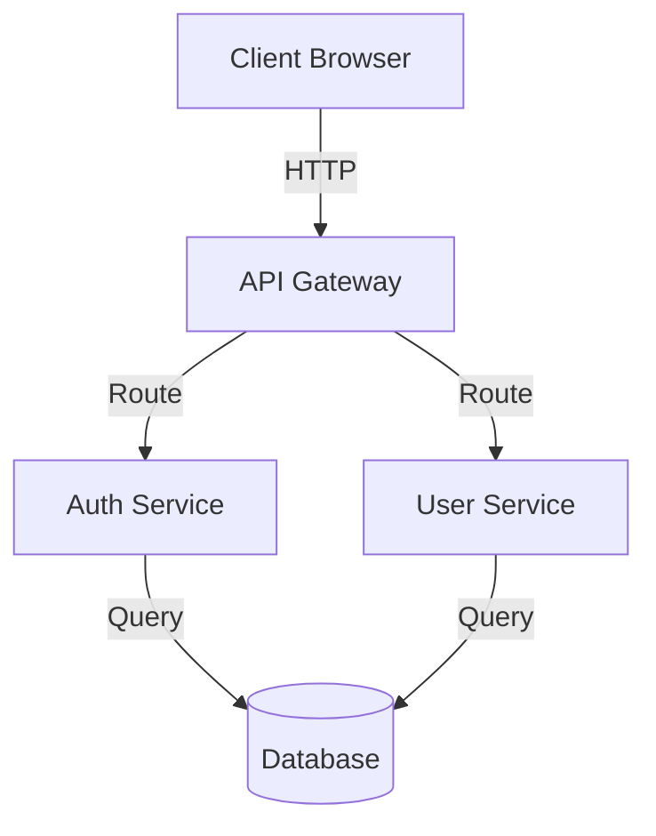

# Design Phase - Rules and Enforcement

## Overview

The DESIGN phase is the second phase in The Lathe's phase-locked development workflow. It transitions from **analysis and discovery** to **architectural thinking and design options** — while still preventing premature code implementation.

---

## Phase Purpose

**Design phase is for:**
- Presenting multiple design options
- Discussing tradeoffs and implications
- Describing architecture and component interactions
- Creating architecture diagrams (ASCII or Mermaid)
- Documenting design patterns and decisions
- Planning migration or transition strategies

**Design phase is NOT for:**
- Writing executable code
- Creating database schemas
- Implementing functionality
- Writing configuration files
- Providing shell commands
- Making implementation decisions

---

## Enforcement

### Validation Rules

The design phase applies these validation rules:

| Rule | What It Does | Severity |
|------|--------------|----------|
| `no_code_output` | Blocks code blocks, keywords, paths, commands | FAIL |
| `require_multiple_design_options` | Requires at least 2 different approaches | WARN |
| `require_tradeoffs` | Requires discussion of pros/cons for each option | WARN |
| `allow_diagrams` | Verifies presence of architectural descriptions | WARN |

---

## No Code Output Rule

The `NoCodeOutputRule` applies to design phase just as it does analysis, preventing:

❌ **Forbidden:**
```python
def authenticate(user):
    return bcrypt.check(password)
```

❌ **Forbidden:**
- Database schemas (`CREATE TABLE users (...)`)
- Configuration files (`.env`, `docker-compose.yml`)
- Shell commands (`npm install`, `docker run`)

✅ **Allowed:**
- Describing that "authentication uses bcrypt hashing" without code
- Explaining component interactions in prose
- ASCII diagrams showing component relationships

---

## Multiple Design Options Rule

The `RequireMultipleDesignOptionsRule` ensures design thinking:

### ❌ Bad: Single Option

```
DESIGN:

The system should use PostgreSQL with connection pooling.
This provides the best performance.
```

**Why it fails:**
- Only one option presented
- No alternatives considered
- No comparison

### ✅ Good: Multiple Options

```
DESIGN OPTIONS:

Option 1: PostgreSQL with Connection Pooling
- Direct SQL queries via connection pool
- Traditional ACID compliance
- Proven reliability at scale

Option 2: NoSQL (MongoDB) with Caching Layer
- Document-based schema flexibility
- Redis caching for frequent queries
- Distributed replication

Option 3: Hybrid Approach
- PostgreSQL for transactional data
- MongoDB for document storage
- Separate read replicas
```

**Why it passes:**
- Presents 3 distinct approaches
- Each option is clearly labeled
- Sets up tradeoff discussion

---

## Tradeoffs Rule

The `RequireTradeoffsRule` ensures design implications are discussed:

### ❌ Bad: No Tradeoffs

```
Option 1: Use Microservices
Option 2: Use Monolith

Microservices is recommended.
```

**Why it fails:**
- No analysis of pros/cons
- No complexity discussion
- Missing implications

### ✅ Good: Tradeoffs Discussed

```
TRADEOFF ANALYSIS:

Option 1: Microservices Architecture
Strengths:
  - Independent scaling of services
  - Technology diversity per service
  - Fault isolation

Weaknesses:
  - Operational complexity increases
  - Network latency between services
  - Distributed debugging challenges

Performance Impact: 50-100ms added latency per inter-service call
Scalability: Excellent horizontal scaling
Maintainability: Higher complexity, specialized teams needed
Cost: Infrastructure costs increase with more services

---

Option 2: Monolithic Architecture
Strengths:
  - Single deployment unit
  - Simpler local development
  - Easier debugging

Weaknesses:
  - Technology lock-in
  - Harder to scale specific components
  - All services affected by one failure

Performance Impact: Sub-millisecond inter-component calls
Scalability: Vertical scaling limits
Maintainability: Simpler architecture, centralized teams
Cost: Lower infrastructure costs initially
```

**Why it passes:**
- Discusses strength/weakness for each
- Addresses multiple tradeoff dimensions
- Compares implications directly

---

## Diagrams Rule

The `AllowDiagramsRule` verifies architectural descriptions exist:

### ✅ Good: Includes Diagrams

```
ARCHITECTURE DIAGRAM:

```
  Client
    |
    v
[API Gateway]
    |
    +---> [Auth Service]
    |
    +---> [User Service]
    |
    +---> [Data Service]
           |
           v
       [Database]
```

Component Description:
- API Gateway: Routes requests, handles rate limiting
- Auth Service: JWT validation, session management
- User Service: Profile management, preferences
- Data Service: Query orchestration, caching
```

**Why it passes:**
- Uses ASCII diagram
- Shows component relationships
- Includes architectural description

### ✅ Alternative: Mermaid Diagram

```
ARCHITECTURE:



Each service is independently deployable and scalable.
```

**Why it passes:**
- Uses Mermaid syntax
- Shows service relationships
- Includes explanation

---

## System Prompt Enforcement

When in design phase, the system prompt includes:

```
DESIGN PHASE REQUIREMENTS:
- NO CODE OUTPUT - You must not write executable code or implementations
- MUST present multiple design options - Consider at least 2 different approaches
- MUST discuss tradeoffs - Explain pros, cons, and implications of each option
- CAN use diagrams - ASCII art and Mermaid diagrams are encouraged
- MUST include architecture descriptions - How components interact

ALLOWED IN DESIGN:
- Architecture descriptions and diagrams
- Tradeoff tables and comparisons
- Design patterns and their justification
- Migration or transition strategies
- Interface specifications (without implementation)
- Component relationships and data flow

FORBIDDEN IN DESIGN:
- Executable code or code fragments
- SQL queries or database schemas
- Configuration files
- Shell commands or deployment scripts

REQUIRED STRUCTURE:
1. Design Options (at least 2)
2. Tradeoff Analysis for each option
3. Architecture Description or Diagram
4. Recommended Approach with justification
```

---

## Good Design Output Example

```
DESIGN DOCUMENT: Authentication Architecture

CONTEXT:
From analysis phase, we identified:
- Security vulnerabilities in password storage
- Need for rate limiting
- Requirement for HIPAA compliance

DESIGN OPTIONS:

Option 1: JWT-based Stateless Authentication
Flow:
  1. User submits credentials
  2. Server validates, generates JWT token
  3. Token includes user ID, roles, expiry
  4. Client includes token in subsequent requests
  5. Server validates token without database lookup

Strengths:
  - Stateless server (horizontal scaling friendly)
  - Can work across multiple servers/domains
  - Reduced database queries

Weaknesses:
  - Token revocation requires token blacklist
  - Token size increases per request
  - Expiry time is fixed at generation

---

Option 2: Session-based Authentication (Database)
Flow:
  1. User submits credentials
  2. Server validates, creates session record
  3. Session ID stored in cookie
  4. Client sends session ID with each request
  5. Server looks up session in database

Strengths:
  - Easy token revocation (delete session)
  - Can change user roles mid-session
  - Smaller cookie size

Weaknesses:
  - Database lookup on every request
  - Requires sticky sessions or session sharing
  - Harder to scale across servers

---

Option 3: Hybrid OAuth2 with JWTs
Flow:
  1. User authenticates via OAuth2 provider
  2. Provider returns short-lived access token
  3. Server exchanges for refresh token
  4. Access token used for API calls
  5. Refresh token renews access when expired

Strengths:
  - Delegated authentication (no password storage)
  - Industry standard (OAuth2)
  - Easy integration with social providers

Weaknesses:
  - Dependency on OAuth provider
  - Additional complexity
  - Requires support for multiple providers

---

TRADEOFF ANALYSIS:

Security (HIPAA Requirement):
  - JWT: Medium (token must be signed with strong key)
  - Session: High (server controls revocation)
  - OAuth2: High (provider handles credentials)

Performance:
  - JWT: Excellent (no database lookup)
  - Session: Fair (database query per request)
  - OAuth2: Good (cached tokens reduce lookups)

Scalability:
  - JWT: Excellent (stateless)
  - Session: Limited (needs shared session store)
  - OAuth2: Excellent (stateless + external provider)

User Experience:
  - JWT: Good (single login, works across domains)
  - Session: Good (auto logout on expiry)
  - OAuth2: Excellent (familiar provider login)

---

RECOMMENDED APPROACH: Option 3 (Hybrid OAuth2 with JWTs)

Justification:
1. Meets HIPAA compliance (delegated authentication)
2. Excellent scalability (stateless)
3. Strong security (provider-managed)
4. Can add local authentication fallback
5. Aligns with modern practices

---

ARCHITECTURE:

```
┌─────────────┐
│   Client    │
└──────┬──────┘
       │
       v
┌──────────────────┐
│  API Gateway     │ (Rate limiting, routing)
└──────┬───────────┘
       │
       v
┌──────────────────┐
│  Auth Service    │ (OAuth2 flow, JWT generation)
└────────┬─────────┘
         │
    ┌────┴─────┐
    v          v
┌────────┐  ┌──────────┐
│ OAuth  │  │ JWT      │
│Provider│  │ Validator│
└────────┘  └──────────┘
```

Data Flow:
1. Client requests login → API Gateway
2. API Gateway routes to Auth Service
3. Auth Service initiates OAuth2 flow
4. Client redirected to OAuth Provider
5. Provider returns authorization code
6. Auth Service exchanges code for tokens
7. Auth Service returns JWT to client
8. Client includes JWT in API calls
9. JWT Validator checks token signature
10. Request proceeds if valid

---

MIGRATION STRATEGY:

Phase 1: Parallel Run (Week 1-2)
  - Deploy new OAuth2 infrastructure
  - Keep existing session auth active
  - Route 10% of users to new system

Phase 2: Gradual Rollout (Week 3-4)
  - Increase new system traffic to 50%
  - Monitor metrics, fix issues
  - Support both old and new authentication

Phase 3: Complete Migration (Week 5)
  - Migrate remaining 50% of users
  - Decommission old session auth
  - Archive legacy session data

---

NEXT STEPS:
1. Approve recommended OAuth2 approach
2. Select OAuth2 providers (Google, GitHub, etc.)
3. Proceed to IMPLEMENTATION phase
```

---

## Testing

Test the design phase enforcement:

```python
from lathe_tool import lathe_plan, lathe_validate

# Prepare design phase
plan = lathe_plan(
    project="myapp",
    scope="authentication",
    phase="design",
    goal="Design authentication architecture"
)

# Output with code (should FAIL)
bad_output = """
DESIGN:
Use JWT with this implementation:

def verify_token(token):
    return jwt.decode(token)
"""

result = lathe_validate(phase="design", output=bad_output)
assert result["status"] == "fail"  # Code detected

# Output with multiple options and tradeoffs (should PASS)
good_output = """
DESIGN OPTIONS:

Option 1: JWT-based Authentication
Pros: Stateless, scalable
Cons: Token revocation difficult

Option 2: Session-based Authentication
Pros: Easy revocation
Cons: Requires session store

TRADEOFF ANALYSIS:
JWT provides better scalability but harder revocation.
Sessions provide easier control but require storage.
"""

result = lathe_validate(phase="design", output=good_output)
assert result["status"] in ["pass", "warn"]
```

---

## Integration with OpenWebUI

When using the Lathe tool in OpenWebUI:

1. **User requests design:** "Design the authentication system architecture"

2. **lathe_plan called:**
   - Returns system prompt with design requirements
   - Includes "multiple options" and "tradeoffs" enforcement

3. **LLM generates design:**
   - Presents multiple approaches
   - Discusses tradeoffs
   - Includes architecture diagram

4. **lathe_validate called:**
   - Validates against `no_code_output` rule → MUST PASS
   - Validates against `require_multiple_design_options` → WARNS if missing
   - Validates against `require_tradeoffs` → WARNS if missing
   - Validates against `allow_diagrams` → WARNS if missing

5. **OpenWebUI displays result:**
   - Shows validation status
   - Lists warnings if quality guidelines not met
   - Can proceed to IMPLEMENTATION phase

---

## Phase Differences

| Aspect | Analysis | Design |
|--------|----------|--------|
| **Purpose** | Discover problems | Create solutions |
| **Output** | Prose findings | Architectural thinking |
| **Diagrams** | Not allowed | Encouraged |
| **Options** | Identify issues | Compare approaches |
| **Allowed** | Questions, risks | Diagrams, tradeoffs |
| **Forbidden** | Code, designs | Code, implementations |
| **No Code Rule** | FAIL severity | FAIL severity |
| **Next Phase** | → Design | → Implementation |

---

## Key Principles

1. **Design Thinking First** - Present options before deciding
2. **No Premature Optimization** - Design, don't implement
3. **Tradeoff-Driven** - Every choice has implications
4. **Architecture Clear** - How components interact matters
5. **Multiple Approaches** - Consider alternatives

---

## Support

- **Implementation:** `lathe/validation/rules.py` → Design rules
- **Enforcement:** `lathe_tool.py` and `lathe/tool/wrapper.py`
- **Testing:** `tests/test_tool_wrapper.py`
- **Phase Discipline:** Design phase enforces options and tradeoffs

---

**Status:** ✅ Implemented and enforced
**Severity:** FAIL for code, WARN for quality guidelines
**Default:** Enabled for all design phase operations
